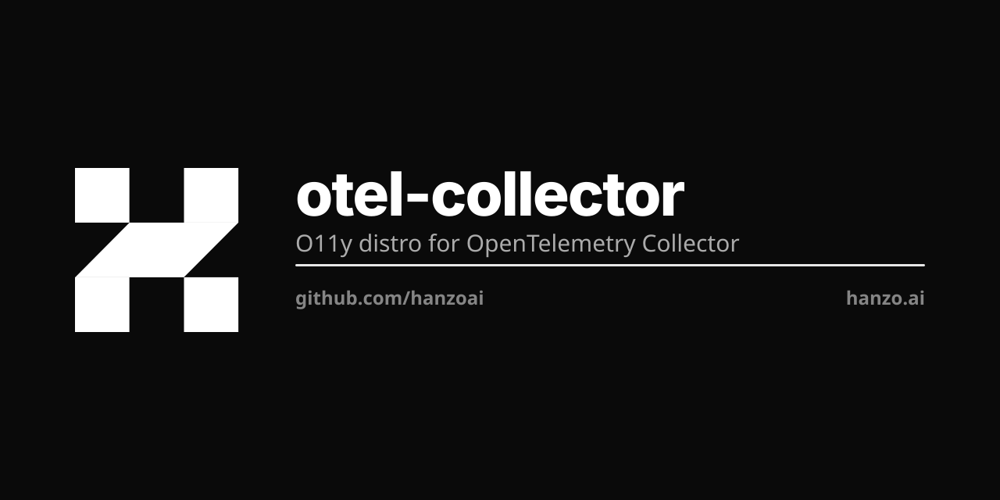

<p align="center"></p>

# Hanzo O11y Otel Collector

The Hanzo distribution of the OpenTelemetry Collector. Ingests traces / metrics /
logs over **ZAP-native** (`zap-proto/http`, `:4319`) plus OTLP (`:4317`/`:4318`)
and writes to the one hanzoai/datastore (ClickHouse). Adds `receiver/zapreceiver`
+ `exporter/zapexporter` over upstream.

## CI/CD — canonical pattern (one and only one way)

Build/test/deploy is driven by a single root **`hanzo.yml`** + a ~7-line
**`.github/workflows/cicd.yml`** that imports the reusable
[`hanzoai/ci`](https://github.com/hanzoai/ci) workflow:

```yaml
# .github/workflows/cicd.yml
jobs:
  cicd:
    uses: hanzoai/ci/.github/workflows/build.yml@main
    secrets: inherit
```

All build/test/deploy logic lives once in `hanzoai/ci`. It reads `hanzo.yml`
(`images:` / `test:` / `deploy:` / `kms:`), builds + pushes each image, runs the
tests, and rolls the deployment. **The build runs on our self-hosted arc pool
(`hanzo-build-linux-amd64`) — zero GitHub-hosted minutes**; GitHub only
orchestrates, our infra does the work. GHCR push uses the automatic workflow
token; KMS (`kms.hanzo.ai`) supplies only the deploy `KUBECONFIG`.

This repo builds two images from self-building multi-stage Dockerfiles (so no CI
pre-build step is needed):

| image | dockerfile | tags |
|---|---|---|
| `ghcr.io/hanzoai/otel-collector` | `cmd/o11yotelcollector/Dockerfile.selfbuild` | `:zap-native-latest`, `:sha-<short>-amd64-zap-native` |
| `ghcr.io/hanzoai/o11y-schema-migrator` | `cmd/o11yschemamigrator/Dockerfile.selfbuild` | `:latest`, `:sha-<short>-amd64` |

**This is the going-forward pattern for all native-PaaS repos.** To onboard a new
repo: add a root `hanzo.yml` and the `cicd.yml` above — nothing else. Do not add
per-repo build logic, GitHub-hosted runners, or the legacy `hanzoai/.github`
`docker-build.yml` / `o11y/primus.workflows` reusables (both removed here).
